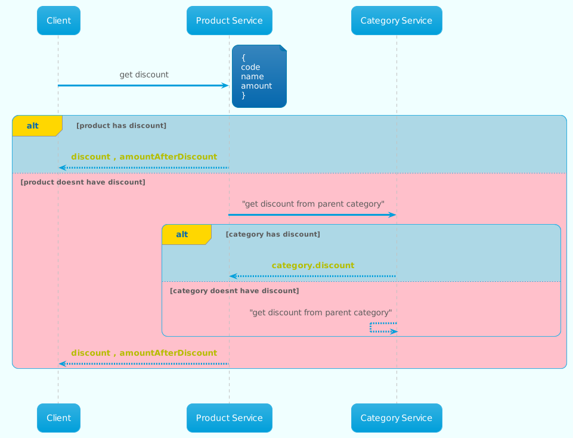
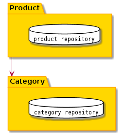

## Description
App to get discount of a product
If the product has a discount this discount has a priority and will be returned.
Otherwise, we move to its parent category (if it exists) and check if it has a discount and so on until the product-category chain is done.
If no discount was found the API will return -1.
<p align="center">


</p>

<p align="center">


</p>


## Installation
```bash
$ npm install
```

## Database
to start a dockerized mongo instance
```bash
$ docker-compose up -d
```
you can use the default config in the env.example

## Running the app

```bash
# development
$ npm run start

# watch mode
$ npm run start:dev

# production mode
$ npm run start:prod
```

## Documentation
[Api Documentation](http://localhost:3033/api/)

## Test

```bash
# unit tests
$ npm run test

# e2e tests
$ npm run test:e2e

# test coverage
$ npm run test:cov
```


